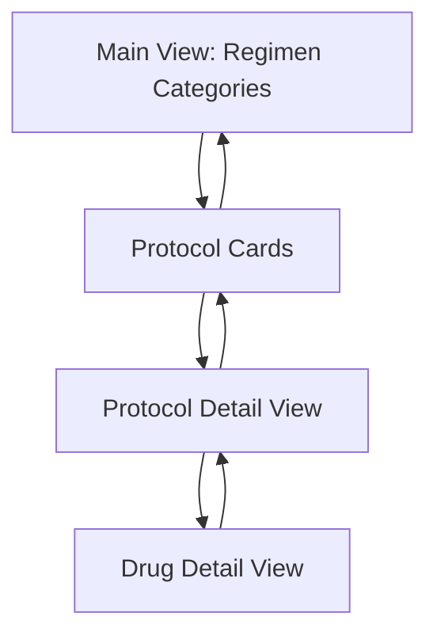

# Treatment Regimen Library Documentation

## Table of Contents
- [Getting Started](#getting-started)
- [Introduction](#introduction)
- [Component Purpose](#component-purpose)
- [Architecture Overview](#architecture-overview)
- [Data Layer](#data-layer)
- [UI Components](#ui-components)
- [Usage Guide](#usage-guide)
- [Technical Reference](#technical-reference)
- [Development](#development)
- [Appendix](#appendix)
- [How Regimens Are Displayed in the UI](#how-regimens-are-displayed-in-the-ui)

## Getting Started
To run the Treatment Regimen Library module locally:

1. **Environment Setup**
   ```bash
   # Ensure Supabase credentials are configured in .env
   VITE_SUPABASE_URL=your_supabase_url
   VITE_SUPABASE_ANON_KEY=your_anon_key
   ```

2. **Dependencies**
   ```bash
   npm install @supabase/supabase-js framer-motion lucide-react
   ```

3. **Development Server**
   ```bash
   npm run dev
   ```

4. **Access Component**
   Navigate to `/cdu/treatment-protocols` in your browser

## Introduction
The Treatment Regimen Library is a comprehensive React component within the OncoVista dashboard that provides an interactive interface for browsing and accessing oncology treatment protocols. It offers a structured view of chemotherapy regimens organized by tumor groups, with detailed information about individual drugs and protocols.

## Component Purpose
- Provides a centralized repository for oncology treatment protocols
- Organizes regimens by tumor groups (breast, GI, GU, etc.)
- Displays detailed drug information including dosing, schedules, and contraindications
- Supports dark/light theme modes for optimal viewing
- Implements responsive design for various screen sizes

## Architecture Overview
### File Structure
```
src/modules/cdu/treatmentProtocols/
├── RegimensLibrary.tsx    # Main component implementation
├── TreatmentProtocols.tsx # Parent wrapper component
└── RegimenLibraryDocs.md  # This documentation
```

### Component Flow Diagram
```
+----------------+     +------------------+     +------------------+
|    Supabase    |     |   RegimensLib    |     |    Protocol     |
|    Database    | --> |    Component     | --> |      Card       |
+----------------+     +------------------+     +------------------+
                              |
                              |         +------------------+
                              +-------> |    Drug Detail   |
                                       |      View         |
                                       +------------------+
```

## Data Layer
### Supabase Schema
```typescript
interface Protocol {
  id: string;
  code: string;
  tumour_group: string;
  treatment_intent: string;
  treatment: {
    drugs: Array<{
      name: string;
      dose: string;
      timing: string;
      administration: string;
    }>;
  };
  tests: Record<string, unknown>;
  dose_modifications: Record<string, unknown>;
  precautions: string[];
  eligibility: string[];
}

interface Drug {
  name: string;
  details: {
    dosing: string;
    schedule: string;
    supportiveCare: string[];
    contraindications: string[];
  };
}

interface RegimenGroup {
  color: string;
  title: string;
  items: Protocol[];
}
```

### Data Transformation Process
1. Fetch raw protocol data from Supabase
2. Parse and validate JSON fields
3. Group protocols by tumor type
4. Apply color coding and formatting
5. Transform into component-ready structures

## UI Components
### Component Hierarchy
```
TreatmentProtocols
└── RegimensLibrary
    ├── ProtocolCard
    ├── ProtocolDetail
    └── DrugDetailView
```

### Visual States
```
Main View (Grid)        Detail View            Drug View
+--------------+      +----------------+     +-------------+
|  Protocol 1  |      | Protocol Info  |     | Drug Info  |
+--------------+ -->  | +-----------+  | --> | • Dosing   |
|  Protocol 2  |      | | Drug List |  |     | • Schedule |
+--------------+      | +-----------+  |     | • Care     |
|  Protocol 3  |      +----------------+     +-------------+
+--------------+
```

## Usage Guide
### Color Coding System
| Cancer Type      | Color  | CSS Class              |
|-----------------|--------|------------------------|
| Breast          | Purple | bg-purple-100/900     |
| GI              | Red    | bg-red-100/900        |
| GU              | Gray   | bg-gray-100/900       |
| Head/CNS        | Green  | bg-green-100/900      |
| Lung/Thoracic   | Blue   | bg-blue-100/900       |
| Hematologic     | Yellow | bg-yellow-100/900     |
| Sarcoma/Rare    | Amber  | bg-amber-100/900      |

### Navigation Flow
1. **Main View**: Browse protocols by tumor group
2. **Protocol View**: Click protocol card to view details
3. **Drug View**: Click drug item to see complete information
4. **Back Navigation**: Use back buttons to return to previous views

## Technical Reference
### Supabase Query
```sql
SELECT 
  id,
  code,
  tumour_group,
  treatment_intent,
  treatment,
  tests,
  dose_modifications,
  precautions,
  eligibility
FROM protocols
ORDER BY tumour_group ASC;
```

### Error Handling
```typescript
try {
  const { data, error } = await supabase.from('protocols').select('*');
  if (error) throw error;
  // Process data
} catch (err) {
  console.error('Error fetching protocols:', err);
  setError(err);
}
```

## Development
### Common Issues & Solutions
1. **No Data Loading**
   - Check Supabase connection
   - Verify environment variables
   - Monitor network requests

2. **JSON Parsing Errors**
   - Validate treatment field format
   - Check precautions/eligibility arrays
   - Use safeSplit helper function

3. **Display Issues**
   - Verify dark mode classes
   - Check responsive breakpoints
   - Validate color assignments

### Performance Optimization
- Implement memo for static components
- Use virtualization for large lists
- Optimize JSON parsing operations
- Cache fetched protocol data

## Appendix
### Example Protocol JSON
```json
{
  "code": "BC-001",
  "tumour_group": "Breast",
  "treatment": {
    "drugs": [
      {
        "name": "Doxorubicin",
        "dose": "60mg/m2",
        "timing": "Day 1",
        "administration": "IV push"
      }
    ]
  },
  "precautions": [
    "Monitor cardiac function",
    "Check CBC before each cycle"
  ],
  "eligibility": [
    "ECOG 0-2",
    "Adequate organ function"
  ]
}
```

### Related Components
- TreatmentProtocols.tsx (parent wrapper)
- EmergencyProtocols.tsx (related functionality)
- EmergencyDetailModal.tsx (shared modal component)

### Future Enhancements
1. **Search & Filtering**
   - Protocol search functionality
   - Treatment intent filtering
   - Advanced filtering options

2. **User Experience**
   - Protocol comparison feature
   - Print/export capabilities
   - Favorite/bookmark system

3. **Integration**
   - EMR system integration
   - Usage analytics
   - Mobile optimization

# How Regimens Are Displayed in the UI

## 🧠 Component Overview

The `RegimensLibrary` component in the OncoVista app dynamically fetches and renders oncology treatment protocols from the `public.protocols` table in Supabase, transforming structured JSON into a clean and responsive UI with category-based navigation.

---

### 📦 Supabase Table Source

Data is fetched from the `public.protocols` table:

```sql
CREATE TABLE public.protocols (
  id uuid PRIMARY KEY DEFAULT gen_random_uuid(),
  code text NOT NULL,
  tumour_group text NOT NULL,
  treatment_intent text,
  treatment jsonb,
  eligibility jsonb,
  tests jsonb,
  dose_modifications jsonb,
  precautions jsonb,
  reference_list jsonb,
  created_at timestamptz DEFAULT now(),
  updated_at timestamptz DEFAULT now()
);
```

---

### 🎨 Grouping & Color Coding

Protocols are grouped by `tumour_group` using a color-coded layout:

| Tumor Group  | Label         | Color Class         |
| ------------ | ------------- | ------------------- |
| `Breast`     | Breast Cancer | `bg-purple-100/900` |
| `Colorectal` | GI Cancer     | `bg-red-100/900`    |
| `Prostate`   | GU Cancer     | `bg-gray-100/900`   |
| `Lung`       | Thoracic      | `bg-blue-100/900`   |
| `Lymphoma`   | Hematologic   | `bg-yellow-100/900` |
| `CNS`        | Head/CNS      | `bg-green-100/900`  |
| `Sarcoma`    | Rare Tumors   | `bg-amber-100/900`  |

---

### 🧱 Protocol Card Structure

Each regimen card is generated from the protocol's `code`, `treatment.drugs[]`, and `treatment_intent`.

```tsx
<RegimenCard
  title={protocol.code}
  drugsCount={protocol.treatment?.drugs?.length}
  intent={protocol.treatment_intent}
/>
```

#### Sample Card Layout:

```
+---------------------------------------+
| 🔬 AC-T Protocol (Adjuvant)           |
| 💊 Drugs: Doxorubicin, Cyclophosphamide |
| ➤ Click to view protocol details      |
+---------------------------------------+
```

---

### 🔎 Protocol Detail View

Clicking a card opens a view like this:

```tsx
<h2>{protocol.code} Protocol</h2>
<p><strong>Intent:</strong> {protocol.treatment_intent}</p>
<ul>
  {protocol.treatment.drugs.map(drug => (
    <li key={drug.name}>{drug.name} – {drug.dose} – {drug.timing}</li>
  ))}
</ul>
```

Other sections include:

* ✅ Eligibility Criteria
* ✅ Dose Modifications
* ✅ Monitoring Tests
* ✅ Supportive Care
* ✅ Precautions

---

### 💊 Drug Detail View

Clicking on a drug name from the detail view expands full metadata:

```tsx
<DrugDetail
  name="Doxorubicin"
  dose="60mg/m²"
  administration="IV push over 3–5 min"
  timing="Day 1"
  supportiveCare={["G-CSF optional", "Monitor LVEF"]}
  contraindications={["Cardiomyopathy", "Pregnancy"]}
  warnings
/>
```

---

### 🧠 TypeScript Interfaces

```ts
interface Protocol {
  id: string;
  code: string;
  tumour_group: string;
  treatment_intent?: string;
  treatment: {
    drugs: Drug[];
  };
  eligibility: string[];
  precautions: string[];
}

interface Drug {
  name: string;
  dose: string;
  timing: string;
  administration: string;
  supportiveCare?: string[];
  contraindications?: string[];
}
```

---

### 🔄 Navigation Flow



Transitions are powered by Framer Motion, and all views support **back navigation** and dark/light themes.

---

### 🚀 Developer Tips

* 💡 Use `.map()` + conditional rendering for JSON parsing
* 💡 Highlight protocol intent with `<Badge>` components
* 💡 Animate card hover using `motion.div`
* 💡 Use `useMemo()` to cache transformed groups
* 💡 Add error boundaries to protect from malformed JSON